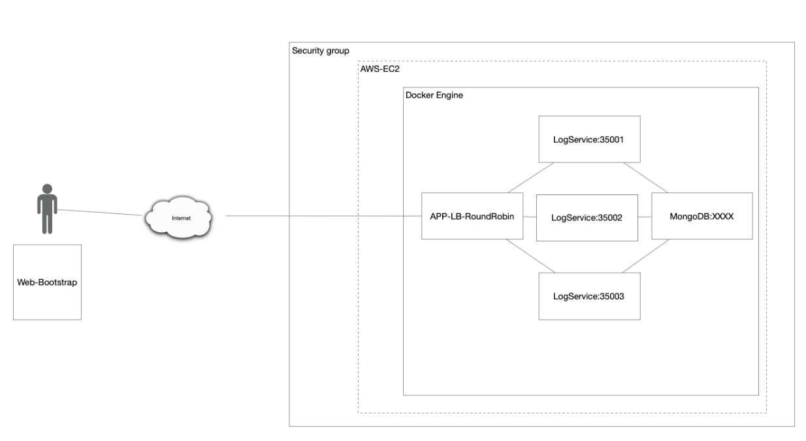

# Taller 5 AREP

## Información del programa 💾

Este proyecto está basado en una arquitectura de tipo Cliente-servidor, en este caso cuenta con 3 servidores y para poder 
distribuir la carga se usa Round Robin con el fin de que no se sature un servidor este lo que hace es repartir en tres la carga,
para el tema del despliegue se usa Docker el cual es capaz de automatizar este proceso usando contenedores. 
En este caso este se almacena en un servidor EC2 de AWS, para ser desplegado desde este.

## Arquitectura



Como podemos ver en la imagen se puede evidenciar fácilmente como se está estructurando, en este caso si no hubiera 
realizado el **APP-LB-RoundRobin** por medio de un **HttpServer** se podría ver de mejor manera la arquitectura 
**Cliente-servidor**, este para poder comunicarse con los **LogServices** utiliza peticiones **GET** el cual usa como Framework 
**Spark**, una vez que es enviada esta información hacia el back este se encarga de almacenarlo dentro de una base de datos 
no relacional, en este caso estamos usando **MongoDB**, después el back le solicita los datos que tenga para este 
encargarse de mandar los 10 últimos datos almacenados dentro de la base datos por medio de **JSON** para ser mostrados en el **Frontend**.

## Generar Imágenes


Para poder generar las imágenes de Docker, se hace una copia del repo, después debemos compilar el backend y el balanceador, para poder hacer esto ingresamos a estas carpetas y utilizamos los comandos.
```
mvn clean install
mvn package
```

Una vez ya compilado debemos estar en la carpeta principal donde ejecutaremos el commando.
```
docker-compose up -d
```
El cual se encargara de generar la imagenes y desplegar el proyecto.

## Requisitos 📋
- Java: Ambiente de desarrollo
- Maven: Administrador del ciclo de vida del Proyecto
- Git: Controlador de versiones

## Construido con 🛠️

IntelliJ IDEA 2022.3.2 (Community Edition)

## Autores ✒️

* **Gabriela Castro Santamaría** [gabriela-castro-s](https://github.com/gabriela-castro-s) 